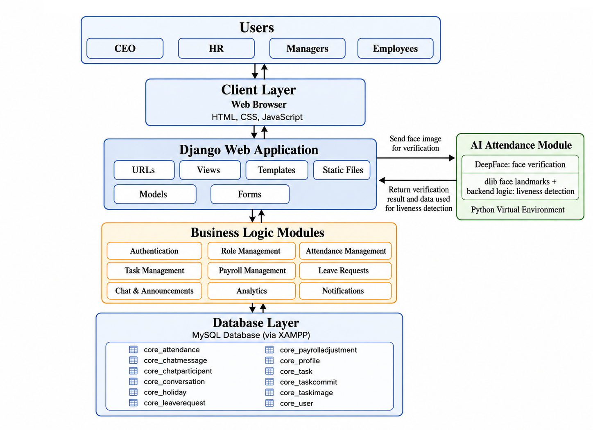

# Workforce System

A Django-based workforce management system for handling employees, managers, HR operations, attendance, payroll adjustments, tasks, calendars, analytics, anomalies, profiles, CVs, and internal chat.

## Main Features

- Role-based dashboards for CEO, HR, managers, and employees
- Login with face registration and face verification
- Attendance check-in/check-out using biometric verification
- Automatic attendance statuses: present, absent, low hours, leave, holiday, and working holiday
- Task assignment, task review, task status updates, daily commits, and task image uploads
- Leave request workflow between employees/managers and HR
- HR staff management for creating managers and employees
- CEO staff management for creating HR accounts
- Payroll/accountant page with salary adjustments, bonuses, deductions, absences, and short-hours calculations
- Analytics and anomaly pages for employees, teams, managers, and HR
- Calendar pages for personal tasks, team tasks, manager tasks, and HR attendance
- Chat with direct conversations, team conversations, and announcements
- Profile page with password change, CV upload/view, and biometric controls where allowed

## Architecture



*The Workforce System follows a layered Django architecture, integrating AI attendance for biometric face verification and liveness detection while keeping business logic modular and maintainable.*

## Download and Run on Your Laptop

### 1. Requirements

Install these first:

- Python 3
- MySQL Server
- Git
- C++ build tools
- A webcam, if you want to test face registration and attendance

This project uses MySQL and computer vision packages such as `dlib`, `opencv`, `deepface`, and `tensorflow`. These packages need native C++ build support, especially `dlib`.

On Windows, install these before running `pip install -r requirements.txt`:

- Microsoft Visual Studio Build Tools
- The "Desktop development with C++" workload
- MSVC C++ build tools
- Windows SDK
- CMake

After installing them, restart your terminal so the compiler tools are available in the PATH.

### 2. Download the Project

Clone the repository:

```bash
git clone https://github.com/KMMKMH/workforce_system
```

If you already received the project folder, open a terminal inside the `backend` folder.

### 3. Create and Activate a Virtual Environment

On Windows PowerShell:

```powershell
python -m venv venv
.\venv\Scripts\Activate.ps1
```

On macOS/Linux:

```bash
python3 -m venv venv
source venv/bin/activate
```

### 4. Install Dependencies

Make sure the C++ build tools above are installed first, then run:

```bash
pip install -r requirements.txt
```

### 5. Create the MySQL Database

Open MySQL and create the database used by the Django settings:

```sql
CREATE DATABASE workforce_db;
```

The current settings expect:

- Database name: `workforce_db`
- User: `root`
- Password: empty
- Host: `localhost`
- Port: `3306`

If your MySQL password is different, update `workforce_system/workforce_system/settings.py` in the `DATABASES` section.

### 6. Run Migrations

Go into the Django project folder:

```bash
cd workforce_system
```

Then run:

```bash
python manage.py migrate
```

### 7. Create the CEO Account

The system has a custom command for creating the first CEO account:

```bash
python manage.py create_ceo
```

Or create it directly with arguments:

```bash
python manage.py create_ceo --username ceo --email ceo@example.com --password YourStrongPassword123
```

If a CEO already exists and you want to update it:

```bash
python manage.py create_ceo --update-existing
```

### 8. Start the Server

```bash
python manage.py runserver
```

Open this in your browser:

```text
http://127.0.0.1:8000/
```

## How to Use the System

### Login and Face Verification

1. Go to `http://127.0.0.1:8000/`.
2. Log in with your username and password.
3. If the user does not have a saved face encoding, the system sends them to face registration.
4. During face registration, allow camera access and follow the instruction to turn your head left or right.
5. After registration, future logins go through face verification.
6. Employees and managers use face verification for attendance check-in and check-out.

CEO, HR, and Accountant users can bypass biometric verification unless biometrics are enabled for their profile.

### Main Dashboard Redirects

After login, `/dashboard/` sends users to the correct place:

- CEO goes to `/ceo/dashboard/`
- HR goes to `/hr/dashboard/`
- Managers and employees use the normal dashboard at `/dashboard/`

### CEO Pages

The CEO dashboard is for high-level manager tracking.

- `/ceo/dashboard/`: view manager attendance, manager list, manager tasks, and assign tasks to managers
- `/ceo/staff/`: create, edit, activate, and deactivate HR accounts
- `/ceo/analytics/`: view manager task progress and attendance summaries
- `/ceo/anomalies/`: view manager attendance anomalies
- `/ceo/calendar/`: view manager task deadlines
- `/chat/`: chat with allowed users and use announcements
- `/profile/`: manage profile and security settings

CEO task flow:

1. Create a task for a manager from the CEO dashboard.
2. The manager works on the task from their own dashboard.
3. The CEO can review progress, change review statuses, edit tasks, delete tasks, and mark tasks done.

### HR Pages

The HR dashboard is for company staff, leave, attendance, and payroll.

- `/hr/dashboard/`: company attendance summary and HR navigation
- `/hr/staff/`: create, edit, activate, and deactivate manager and employee accounts
- `/hr/leave-requests/`: approve or reject leave requests
- `/hr/analytics/`: company staff analytics
- `/hr/accountant/`: payroll/accountant view with salary calculations
- `/hr/accountant/bonus/add/`: add salary adjustments, bonuses, or deductions
- `/hr/attendance-calendar/`: calendar view of staff attendance
- `/chat/`: chat with allowed users and use announcements
- `/profile/`: manage profile and security settings

HR staff creation notes:

- HR can create managers and employees.
- Employees must be assigned to a manager.
- Staff records can include phone, department, position, salary, manager, password, and CV-related profile data.

Leave flow:

1. An employee or manager submits a leave request.
2. HR opens the Leave Requests page.
3. HR approves the request or rejects it.
4. Approved leave is used by attendance calculations.

Payroll flow:

1. HR opens the Accountant page.
2. Choose a month.
3. Review salary, deductions, holiday overtime, bonuses, absences, short hours, and net pay.
4. Add a positive adjustment for a bonus or a negative adjustment for a deduction.

### Manager Pages

Managers have both a personal dashboard and a team dashboard.

- `/dashboard/`: manager personal dashboard with assigned tasks
- `/manager/dashboard/`: team dashboard
- `/manager/analytics/`: team analytics
- `/manager/anomalies/`: team attendance anomalies
- `/manager/calendar/`: team task calendar
- `/leave/request/`: submit leave requests
- `/calendar/`: personal task calendar
- `/chat/`: chat with HR, CEO, managers, and team employees according to permissions
- `/profile/`: manage profile, password, CV, and biometric data

Manager task flow:

1. Open Team Dashboard.
2. Assign tasks to employees in the manager's team.
3. Track employee attendance and task progress.
4. Review tasks when employees mark them ready.
5. Mark tasks done or send them back for more work.

### Employee Pages

Employees use the system for attendance, assigned tasks, leave, analytics, and communication.

- `/dashboard/`: personal dashboard with attendance status and assigned tasks
- `/tasks/<task_id>/`: task details, commits, images, and status updates
- `/leave/request/`: submit leave requests
- `/analytics/`: personal performance analytics
- `/analytics/anomalies/`: personal attendance anomalies
- `/calendar/`: personal task deadline calendar
- `/chat/`: chat with HR and the employee's manager
- `/profile/`: manage profile, password, CV, and biometric data

Employee task flow:

1. Open the dashboard and select a task.
2. Start the task by moving it from Pending to In Progress.
3. Add daily commits/comments on the task detail page.
4. Upload task images when needed.
5. Mark the task Ready for Review when finished.
6. The manager reviews it and either marks it Done or sends it back.

### Attendance Rules

Attendance applies mainly to managers and employees.

- Check-in and check-out are handled through face verification.
- The normal minimum work threshold is 7 hours.
- More than 12 hours is flagged as an anomaly.
- Missing check-out records are auto-closed and marked as anomalies.
- Weekends and holidays are treated as non-working days.
- Approved leave is counted as leave.
- Working on a holiday/weekend can be marked as working holiday.

### Chat Rules

The system supports direct chats, team chats, and announcements.

Direct chat permissions:

- CEO can chat with HR and managers
- HR can chat with everyone
- Managers can chat with CEO, HR, and their team employees
- Employees can chat with HR and their own manager

Team chat:

- Each manager has a team conversation with their employees.

Announcements:

- CEO and HR can send announcements.
- Other users can read announcements.

### Profile and Security

The Profile page lets users manage account-related information.

Common actions:

- View personal and work information
- Change password
- Upload or view CV where allowed
- Manage face registration/biometric data where allowed

Password change pages:

- `/password/change/`
- `/password/change/done/`

## Important Project Paths

- Django project folder: `workforce_system/`
- Main settings: `workforce_system/workforce_system/settings.py`
- URL routes: `workforce_system/workforce_system/urls.py`
- Main app: `workforce_system/core/`
- Models: `workforce_system/core/models.py`
- Views: `workforce_system/core/views.py`
- Forms: `workforce_system/core/forms.py`
- Templates: `workforce_system/core/templates/`
- Static files: `workforce_system/core/static/`
- Uploaded media: `workforce_system/media/`
- Face landmark model: `workforce_system/core/models/shape_predictor_68_face_landmarks.dat`

## Common Commands

Run the server:

```bash
cd workforce_system
python manage.py runserver
```

Create database tables:

```bash
python manage.py migrate
```

Create or update CEO:

```bash
python manage.py create_ceo
python manage.py create_ceo --update-existing
```

Create an admin superuser, if you need Django admin:

```bash
python manage.py createsuperuser
```

Open Django admin:

```text
http://127.0.0.1:8000/admin/
```

## Troubleshooting

### MySQL Connection Error

Make sure MySQL is running and that the database exists:

```sql
CREATE DATABASE workforce_db;
```

Then check the `DATABASES` section in `workforce_system/workforce_system/settings.py`.

### Camera Does Not Open

Allow camera permissions in the browser. Face registration and verification need webcam access.

### `dlib` Install Fails

This usually means the C++ compiler tools are missing or were installed after the terminal was opened. On Windows, install Visual Studio Build Tools with "Desktop development with C++", MSVC, Windows SDK, and CMake. Then close the terminal, open it again, activate the virtual environment, and run:

```bash
pip install -r requirements.txt
```

### Static Files Look Missing

During development, Django serves static files automatically when `DEBUG = True`. Make sure you started the app with:

```bash
python manage.py runserver
```

from inside the `workforce_system` folder.
